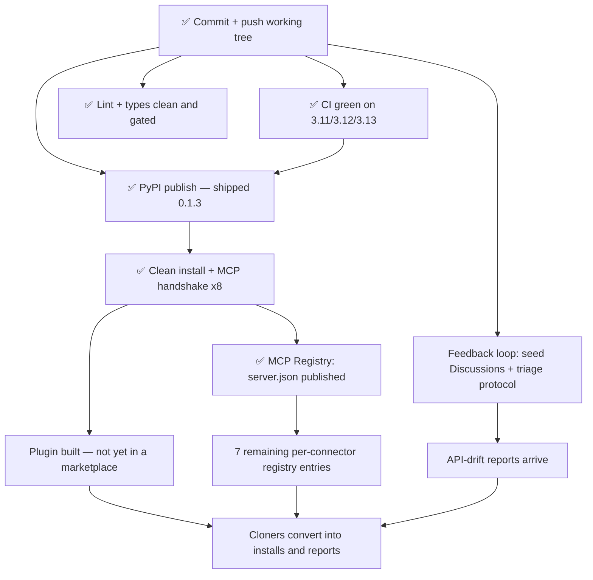

# Distribution — spec and update plan

Written 2026-09-05 against `master` @ working tree (v0.1.1, uncommitted).
**Status 2026-09-05, end of day: shipped.** `yzel 0.1.3` is on PyPI, listed in the MCP
Registry as `isLatest`, and all 8 servers complete an MCP handshake from a clean install.
The DAG below is kept as written; ✅ marks what landed. Live state lives in `NEXT.md`.
Companion to `ROADMAP.md` (what gets built) — this covers **how it reaches anyone**.
Tactical queue lives in `NEXT.md`; this is the reasoning behind that queue's order.

## Problem Statement

Yzel is being found and cloned by its actual audience, and none of them can install it.

GitHub traffic, 14-day window, verified 2026-09-05:

| | |
|---|---|
| Views / unique visitors | 85 / **28** |
| Clones / **unique cloners** | 37 / **23** |
| Referrers | Google 10 uniq · ya.ru 2 · yandex.ru 1 · **chatgpt.com 1** · github 1 |
| Stars | 3 — `gidmagstore-ctrl`, `foodtoday14-dev`, `myu-ru` |
| **Issues filed** | **0** |

Read the stargazers: a store-control account, a food-retail account, a `.ru` account. That is
the ICP from `_context.md` (CIS retail sellers, 1C integrators), not passing developers. The
traffic is organic — Google and Yandex, plus one referral from ChatGPT. Nothing was promoted;
there was never a Show HN post.

Three things are wrong at once:

1. **`pypi.org/pypi/yzel/json` returns 404.** Every one of those 23 cloners had to
   `git clone` and `uv sync`.
2. **The MCP config the README documented could not work outside a checkout.** It used
   `{"command": "uv", "args": ["run", "python", "-m", "yzel.connectors.onec.server"]}`, and
   `uv run` resolves against the current working directory's project. MCP clients spawn servers
   with an arbitrary cwd, so it started only if cwd happened to be a yzel clone — otherwise it
   failed silently at launch, which is exactly how MCP clients fail. Fixed in the working tree,
   not yet published.
3. **Zero issues from 23 cloners.** For a from-source install of an eight-connector integration
   package, that reads as silent bounce, not silent success. There was no channel: no
   `CONTRIBUTING.md`, no issue templates, Discussions off.

The problem is not discovery. It is conversion and instrumentation.

## Solution

Make the thing installable in one line from anywhere, list it where MCP clients look, and give
the people who already arrive a way to say it broke.

Terminal node is the problem statement's inverse: the 23 unique cloners a fortnight stop
leaking. Every node has a prerequisite edge or is a root at `R`. Acyclic.

## Glossary (Ubiquitous Language)

The canonical project glossary is `CLAUDE.md` § Glossary — **Connector**, **Sidecar**,
**Tenant**, **Users**. It is not restated here. These are the distribution-domain terms this
spec adds; they were absent because the repo had no distribution surface to name.

| Term | Definition | Aliases to avoid |
|------|------------|------------------|
| **Console script** | A `[project.scripts]` entry point installed on PATH. Yzel ships 9: `yzel` plus one per connector. | "binary", "executable", "command" |
| **Entry point** | The sync `run()` in a connector's `server.py` that a console script targets. Distinct from `main()`, which is async. | "main", "launcher" |
| **Registry entry** | One `server.json` published to registry.modelcontextprotocol.io under an `io.github.Aiyo28/…` name. One entry = one MCP server. | "listing", "package", "registration" |
| **Plugin** | A Claude Code plugin: `.claude-plugin/plugin.json` + `.mcp.json`. A thin wrapper over the PyPI package, **not** an alternative to it. | "extension", "add-on", "integration" |
| **Cloner** | A unique GitHub account that cloned the repo in the traffic window. The conversion denominator. | "user", "visitor", "download" |
| **Drift report** | An issue on the `api_drift` template: a vendor changed a response shape. | "bug", "regression" |

**Layering rule, because this is the confusion this spec exists to kill:** PyPI is the substrate,
MCP is the protocol, the registry is cross-client discovery, and the plugin is a one-command
installer for Claude Code only. The plugin does not replace PyPI — its `.mcp.json` resolves
`uvx --from yzel …`, so it *depends* on PyPI.

## User Stories

1. As a **1C integrator on Windows without WSL**, I want to paste one JSON block into Claude
   Desktop and have the connector start, so that I never clone a repo or pick a directory.
2. As a **Wildberries seller**, I want `uvx --from yzel yzel-wildberries` to fetch and run with
   nothing pre-installed, so that trying Yzel costs one line and no commitment.
3. As an **MCP client user on Cursor / Cline / ChatGPT**, I want Yzel resolvable from the MCP
   Registry, so that I am not restricted to whichever client the author uses.
4. As a **Claude Code user**, I want `/plugin install yzel` to wire all eight connectors at once,
   so that I do not hand-edit eight `mcpServers` entries.
5. As a **cloner whose server did not start**, I want a two-field issue form that asks "which
   connector" and "which step", so that reporting costs 60 seconds and not a bug-report essay.
6. As a **seller whose Ozon call returned a shape Yzel could not parse**, I want a drift template
   that asks for the raw response, so that my report updates both the client and its mock.
7. As **the maintainer**, I want CI to run 138 tests on 3.11/3.12/3.13 on every push, so that a
   contributor's PR is checked without me remembering to run anything.
8. As **the maintainer**, I want a badge that is honest, so that a green CI means the checks that
   run actually pass, rather than the checks that pass being the only ones that run.

## Implementation Decisions

**Already in the working tree, uncommitted** (verified via `git status` 2026-09-05). Do not
re-do; the plan below assumes these land as one commit:

- `pyproject.toml` → `0.1.1`; nine console scripts (`yzel`, `yzel-1c`, `yzel-bitrix24`,
  `yzel-amocrm`, `yzel-moysklad`, `yzel-wildberries`, `yzel-ozon`, `yzel-telegram`, `yzel-iiko`).
- Sync `run()` entry point added to all eight `connectors/*/server.py`; the `__main__` block now
  calls `run()`. Behaviour identical, 138 tests still pass.
- `README.md` — uvx-first install, connector→command table, corrected `mcpServers` block, and
  `<!-- mcp-name: io.github.Aiyo28/yzel -->` (the PyPI ownership token the registry reads).
- `server.json` — validates against the `2025-12-11` schema. `registryType: pypi`,
  `runtimeHint: uvx`, `runtimeArguments` `--from yzel` + positional `yzel-1c`, `YZEL_KEY` as an
  optional secret env var.
- `llms.txt`, `SECURITY.md`, `CHANGELOG.md`, `CONTRIBUTING.md`, `.github/workflows/ci.yml`,
  three issue templates (`bug_report`, `api_drift`, `config`), `docs/TESTING.md`,
  `docs/LIVE-CHECKS.md`.
- Doc fix: credentials are at `~/.yzel/store.db`, not `~/.yzel/vault.db`. README and
  `docs/ARCHITECTURE.md` corrected.

**Modules still to build.**

| Module | Interface (narrow) | Behind it (rich) | Depends on |
|---|---|---|---|
| **Registry entry** | one resolvable name, `io.github.Aiyo28/yzel` | ownership verification against the PyPI description, schema conformance, version pinning | PyPI publish |
| **Claude Code plugin** | `/plugin install yzel` | `.claude-plugin/plugin.json` + `.mcp.json` with 8 stdio entries, each `uvx --from yzel <script>` | PyPI publish |
| **Feedback loop** | "it broke" in under 60s | 3 issue templates (built), Discussions (on), a triage protocol that closes the loop back into mocks | commit + push |
| **Live verification** | the run log in `docs/LIVE-CHECKS.md` | per-connector read probes, read-only/mutating split, sandbox routing | a real tenant |

**Sequencing constraints — these are hard, not preferences:**

- **Registry after PyPI.** The registry verifies ownership by finding `mcp-name:
  io.github.Aiyo28/yzel` in the *package description on PyPI*, which is rendered from
  `README.md`. No PyPI package → nothing to verify against. Recorded in the vault as `[I]`#77
  back in April; re-confirmed against the live docs 2026-09-05.
- **Plugin after PyPI.** The plugin's `.mcp.json` calls `uvx --from yzel`. Building it first
  would mean bundling source and resolving dependencies at first run — Claude-Code-only, and a
  worse install than the one it replaces.
- **The 7 remaining registry entries after the first one verifies.** `[I]`#77 flagged in April
  that per-connector entries "may need one `server.json` per bundle" and that is still unresolved.
  Publishing eight unverified entries as a first attempt is the wrong risk.
- **Lint gating after the lint pass.** Enabling the jobs first paints a red badge on a repo
  being actively cloned.

## Testing Decisions

Layer contracts live in `docs/TESTING.md`; the live protocol in `docs/LIVE-CHECKS.md`. Neither
is restated here. What this spec adds:

- **The distribution work has one test that matters: a clean machine.** After `uv publish`, run
  `uvx --from yzel yzel-1c` somewhere that has never seen the repo. That single check covers the
  console scripts, the wheel contents, the entry points and the cwd-independence fix at once.
  CI's `build` job checks the eight `run()` callables resolve, but CI runs inside a checkout and
  therefore cannot prove cwd-independence — which is the exact bug being fixed.
- **The registry entry is testable before publishing:** `mcp-publisher validate` plus the
  jsonschema check already run against the `2025-12-11` schema.
- **CI runs the suite only, deliberately.** `ruff check` reports **66**, `ruff format --check`
  would reformat **27 files**, `mypy --strict` reports **55 errors in 18 files** — all verified
  2026-09-05, all accumulated because nothing ever gated them. Gating now ships a red badge.
  Fix in a dedicated pass, then add the jobs.

## Out of Scope

- **Connector work.** v0.2 (WhatsApp via `wacli`, goszakup.gov.kz, AmoCRM OAuth browser flow),
  v0.3 meetings tier, deferred Kaspi/Halyk/Jusan banking tier. All stay in `ROADMAP.md`. None of
  it helps the 23 cloners who cannot install what already exists.
- **The lint and type cleanup itself.** 121 findings across 27 files is its own pass with its own
  review; this spec only decides *when* it gates CI.
- **Any marketing apparatus.** `CLAUDE.md` is explicit: no pricing pages, no funnels, no Pro-tier
  hints. A Show HN post and a registry listing are distribution, not marketing; a landing page
  with a CTA is not in scope here.
- **Vault updates.** `Projects/yzel/_context.md` still records the credential path as
  `~/.yzel/vault.db` and the install as from-source. Both are now stale. Out of scope for a
  repo-local spec — flagged so it gets fixed vault-side.

## Non-Goals

What would satisfy this spec's letter while defeating its purpose:

| # | Looks like success | Actually means |
|---|---|---|
| 1 | "Published to PyPI" | …but published from a tree where the README still carries the `uv run` config, so the package installs and the integration still fails silently. The README **is** the PyPI description; publishing the wrong one ships the bug wider. |
| 2 | "Listed in the MCP Registry" | …under a name nobody searches. The entry's description is capped at 100 characters and is the only text a client sees; "Yzel" alone matches no query a 1C integrator types. |
| 3 | "Issue templates exist, Discussions enabled" | …and zero issues still arrive, because a channel nobody is pointed at is not instrumentation. The templates only pay once traffic can convert. |
| 4 | "CI is green" | …because CI runs only the checks that pass. Honest today (the omission is documented in three places); dishonest the moment the lint pass lands and the jobs are not enabled. |
| 5 | "The 1C smoke test is done" | …against a Fresh trial tenant, which per `[I]`#78 publishes transport but zero `EntityType`s. A green transport check is not the data-plane proof the README's central claim needs. |
| 6 | "Cloners converted" | …measured by clone count, which includes CI and scrapers. The honest signal is a first inbound issue or drift report from an account that is not the maintainer. |

## Further Notes

**The 1C data-plane proof is blocked, not pending.** `NEXT.md` has carried the
Бухгалтерия-template smoke test as an open task since 2026-04-24, which reads as "nobody got
round to it." Vault `[I]`#78 says otherwise: 1C:Fresh **trial tenants structurally block** the
OData data plane — confirmed on `msk1.1cfresh.com/a/sbm_demo/4001896/`, where `/$metadata`
returns HTTP 200 with only system `ComplexType`s and zero `EntityType`s. Real business-object
publication needs Configurator access or tenant-admin rights, neither of which trials grant. So
the task needs **an on-prem infobase or a paid Fresh tenant with admin rights** — acquisition,
not an afternoon. Anyone planning it as a quick win will burn a session and rediscover `[I]`#78.

**Risk: the window is open now.** The traffic is arriving from Google and Yandex today, against
a README that documents a config which cannot work. Every day unpushed spends more of the only
demand signal this repo has. That is what puts commit-and-push above everything else, ahead of
items with larger eventual payoff.

**Open question carried, not resolved:** whether the registry wants one entry per connector or
one per package. `[I]`#77 raised it in April; the schema allows either reading. The plan
deliberately publishes one and learns.

**Measurement.** Re-pull `gh api repos/Aiyo28/yzel/traffic/{views,clones,popular/referrers}`
after PyPI lands. Clones should fall and PyPI downloads should rise — a clone that becomes a
`uvx` fetch is the conversion this spec is named for. GitHub only retains 14 days, so the
baseline above is the only record of the pre-PyPI state.
